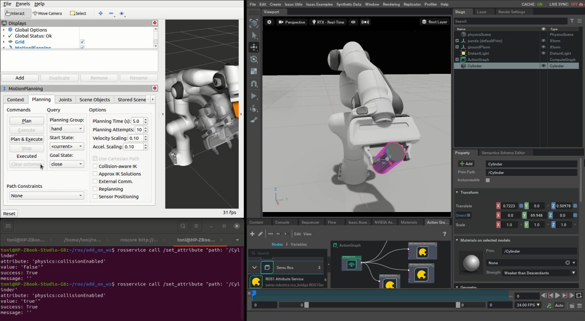
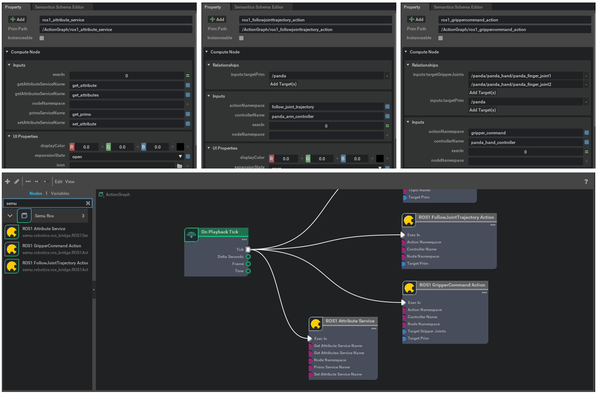

## ROS Bridge (external extension) for NVIDIA Omniverse Isaac Sim

> This extension enables the ROS action server interfaces for controlling robots (particularly those used by MoveIt to talk to robot controllers: [FollowJointTrajectory](http://docs.ros.org/en/api/control_msgs/html/action/FollowJointTrajectory.html) and [GripperCommand](http://docs.ros.org/en/api/control_msgs/html/action/GripperCommand.html)) and enables services for agile prototyping of robotic applications in [ROS](https://www.ros.org/)

<br>

**Target applications:** NVIDIA Omniverse Isaac Sim

**Supported OS:** Linux

**Changelog:** [CHANGELOG.md](exts/semu.robotics.ros_bridge/docs/CHANGELOG.md)

**Table of Contents:**

- [Prerequisites](#prerequisites)
- [Extension setup](#setup)
- [Extension usage](#usage)
- [Supported components](#components)
    - [Attribute](#ros-attribute)
    - [FollowJointTrajectory](#ros-follow-joint-trajectory)
    - [GripperCommand](#ros-gripper-command)

<br>



<hr>

<a name="prerequisites"></a>
### Prerequisites

All prerequisites described in [ROS & ROS2 Bridge](https://docs.omniverse.nvidia.com/app_isaacsim/app_isaacsim/ext_omni_isaac_ros_bridge.html) must be fulfilled before running this extension

<hr>

<a name="setup"></a>
### Extension setup

1. Add the extension using the [Extension Manager](https://docs.omniverse.nvidia.com/prod_extensions/prod_extensions/ext_extension-manager.html) or by following the steps in [Extension Search Paths](https://docs.omniverse.nvidia.com/py/kit/docs/guide/extensions.html#extension-search-paths)

    * Git url (git+https) as extension search path
    
        ```
        git+https://github.com/Toni-SM/semu.robotics.ros_bridge.git?branch=main&dir=exts
        ```

    * Compressed (.zip) file for import

        [semu.robotics.ros_bridge.zip](https://github.com/Toni-SM/semu.robotics.ros_bridge/releases)

2. Enable the extension using the [Extension Manager](https://docs.omniverse.nvidia.com/prod_extensions/prod_extensions/ext_extension-manager.html) or by following the steps in [Extension Enabling/Disabling](https://docs.omniverse.nvidia.com/py/kit/docs/guide/extensions.html#extension-enabling-disabling)

<hr>

<a name="usage"></a>
### Extension usage

Enabling the extension initializes a ROS node named `/SemuRosBridge` (configurable in the `extension.toml` file). This node will enable, when the simulation starts, the ROS topics, services and actions protocols according to the ROS prims (and their configurations) existing in the current stage

Disabling the extension shutdowns the ROS node and its respective active communication protocols

> **Note:** The current implementation only implements position control (velocity or effort control is not yet supported) for the FollowJointTrajectory and GripperCommand actions 

<hr>

<a name="components"></a>
### Supported components



<br>

The following components are supported:

<a name="ros-attribute"></a>
* **Attribute (ROS service):** enables the services for getting and setting the attributes of a prim according to the service definitions described bellow 

    To add an Attribute service action search for ActionGraph nodes and select ***ROS1 Attribute Service*** 

    The ROS package [add_on_msgs](https://github.com/Toni-SM/semu.robotics.ros_bridge/releases) contains the definition of the messages (download and add it to a ROS workspace). A sample code of a [python client application](https://github.com/Toni-SM/semu.robotics.ros_bridge/releases) is also provided

    Prim attributes are retrieved and modified as JSON (applied directly to the data, without keys). Arrays, vectors, matrixes and other numeric classes (```pxr.Gf.Vec3f```, ```pxr.Gf.Matrix4d```, ```pxr.Gf.Quatf```, ```pxr.Vt.Vec2fArray```, etc.) are interpreted as a list of numbers (row first)

    * **add_on_msgs.srv.GetPrims**: Get all prim path under the specified path

        ```yaml
        string path             # get prims at path
        ---
        string[] paths          # list of prim paths
        string[] types          # prim type names
        bool success            # indicate a successful execution of the service
        string message          # informational, e.g. for error messages
        ```
    
    * **add_on_msgs.srv.GetPrimAttributes**: Get prim attribute names and their types
        
        ```yaml
        string path             # prim path
        ---
        string[] names          # list of attribute base names (name used to Get or Set an attribute)
        string[] displays       # list of attribute display names (name displayed in Property tab)
        string[] types          # list of attribute data types
        bool success            # indicate a successful execution of the service
        string message          # informational, e.g. for error messages
        ```
    
    * **add_on_msgs.srv.GetPrimAttribute**: Get prim attribute
        
        ```yaml
        string path             # prim path
        string attribute        # attribute name
        ---
        string value            # attribute value (as JSON)
        string type             # attribute type
        bool success            # indicate a successful execution of the service
        string message          # informational, e.g. for error messages
        ```
    
    * **add_on_msgs.srv.SetPrimAttribute**: Set prim attribute
        
        ```yaml
        string path             # prim path
        string attribute        # attribute name
        string value            # attribute value (as JSON)
        ---
        bool success            # indicate a successful execution of the service
        string message          # informational, e.g. for error messages
        ```

<a name="ros-follow-joint-trajectory"></a>
* **FollowJointTrajectory (ROS action):** enables the actions for a robot to follow a given trajectory

    To add a FollowJointTrajectory action search for ActionGraph nodes and select ***ROS1 FollowJointTrajectory Action*** 

    Select, by clicking the **Add Target(s)** button under the `inputs:targetPrims` field, the root of the robot's articulation tree to control and edit the fields that define the namespace of the communication. The communication will take place in the namespace defined by the following fields:

    ```
    controllerName + actionNamespace
    ```

<a name="ros-gripper-command"></a>
* **GripperCommand (ROS action):** enables the actions to control a gripper

    To add a GripperCommand action search for ActionGraph nodes and select ***ROS1 GripperCommand Action*** 

    Select, by clicking the **Add Target(s)** button under the `inputs:targetPrims` field, the root of the robot's articulation tree to which the end-effector belongs and add the joints (of the gripper) to control using the `inputs:targetGripperJoints` field
    
    Also, edit the fields that define the namespace of the communication. The communication will take place in the namespace defined by the following fields:

    ```
    controllerName + actionNamespace
    ```

    > **Note:** The GripperCommand action definition doesn't specify which joints will be controlled. The value manage by this action will affect all the specified joints equally
